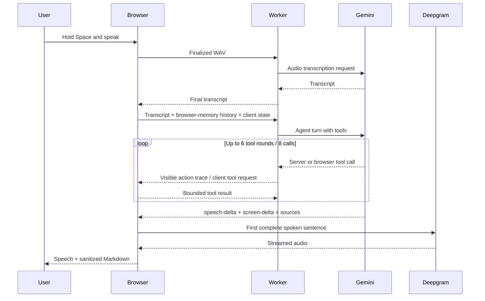

# Orion architecture

## Voice turn

[`runOrionVoiceWorkflow`](../src/voice/workflow/runOrionVoiceWorkflow.ts) is the orchestration boundary for a completed recording. It receives a finalized transcript, asks the Gemini turn client to resolve tool calls and stream the final response, commits both response surfaces, then starts display and speech output independently.

## Trust boundaries

| Boundary | Responsibility |
|---|---|
| Browser | Camera, hand landmarks, conversation history, control arbitration, scene state, audio capture, UI tools |
| Cloudflare Worker | Signed sessions, rate policy, request validation, provider credentials, Gemini tool loop, SSE streaming |
| Gemini | Audio transcription, reasoning, tool selection, grounded answers, dual-surface response generation |
| Deepgram | Streamed text-to-speech output |
| Microsoft Clarity | Masked interaction analytics; never receives Orion's audio pipeline or provider credentials |

## Control authority

`hand > voice > ambient`. A stable hand cancels an active voice animation at its current transform. A voice scene command received during hand authority is rejected and returned to Gemini so the agent can explain the actual result. Commands are never delayed and replayed after the user's hand disappears.

## State and persistence

- Calibration and visual tuning use versioned browser `localStorage`.
- Conversation history is browser-memory only.
- The signed HttpOnly session cookie contains identity, expiry, turn count, owner flag, and a salted IP hash.
- Tool continuation tokens are signed, short-lived, and carry only bounded loop state.
- No audio, transcript, answer, or conversation database exists.

## Failure behavior

Provider responses are normalized to stable error codes. Text remains visible when TTS fails; hand control remains available when voice APIs fail; voice remains available when camera access fails. Barge-in cancels Gemini streaming, pending client tools, progress speech, and final speech as a single operation.
